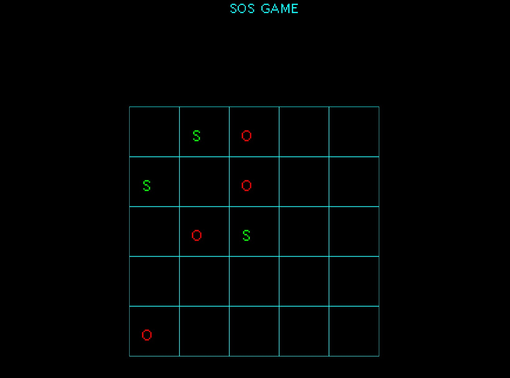
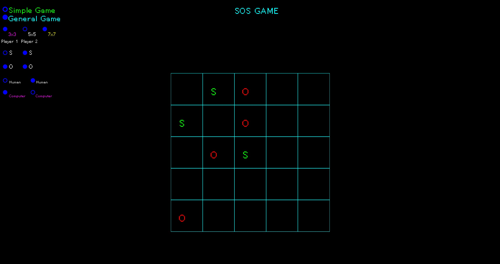
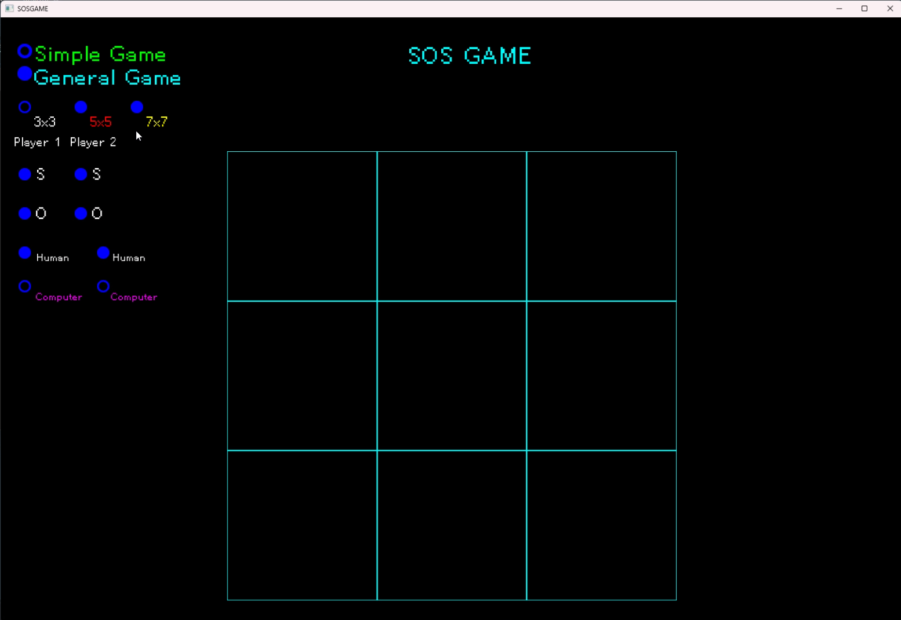
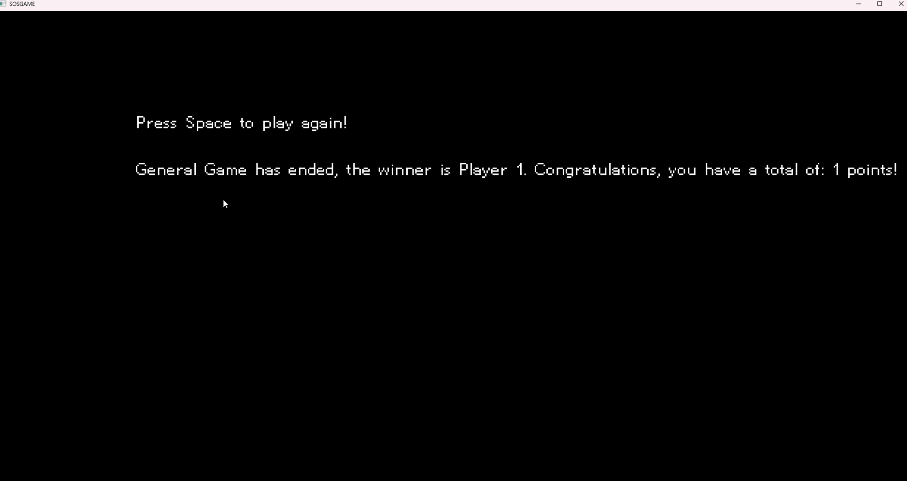

This project is a C++ game built with SFML that recreates the classic SOS paper-and-pencil game. It supports multiple board sizes (3×3, 5×5, 7×7), two game modes (Simple and General), and flexible player configurations including Human vs Human or Human vs Computer. The UI displays options cleanly and renders the game board using SFML shapes and text.

The project was developed as a way to practice SFML, event-driven input, state management, and core game logic while building a fully interactive, semi-polished small game.

Image examples below:

Early Board render

Final Board and polished pictures:

